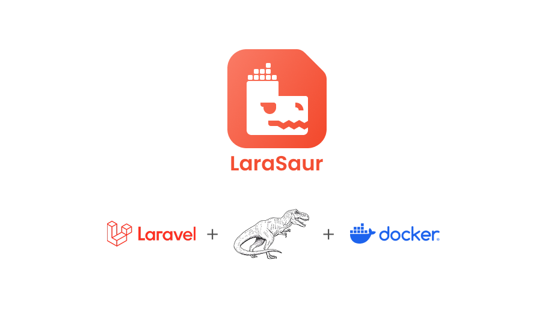
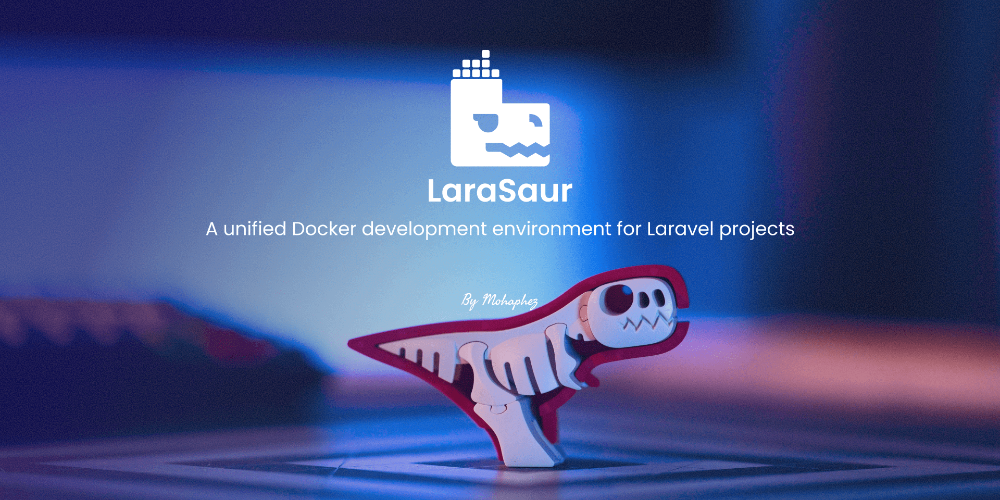
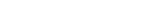
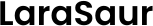
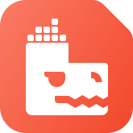
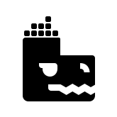
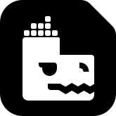
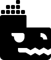

# Larasaur Art Assets

This directory contains all the visual assets used in the Larasaur project.

## Directory Structure

```
art/
├── assets/
│   └── concept.png            # Concept artwork for the project
├── cover/
│   ├── high-quality.png       # High-resolution cover image
│   └── low-quality.png        # Lower-resolution cover image
└── logo/
    ├── colored/
    │   ├── frameless.svg      # Colored logo without frame
    │   └── framed.svg         # Colored logo with frame
    ├── solid/
    │   ├── frameless/
    │   │   ├── dark.svg       # Solid frameless logo (dark version)
    │   │   └── light.svg      # Solid frameless logo (light version)
    │   └── framed/
    │       ├── dark.svg       # Solid framed logo (dark version)
    │       └── light.svg      # Solid framed logo (light version)
    └── type/
        ├── colored.svg        # Colorful typography logo
        ├── dark.svg           # Dark typography logo
        └── light.svg          # Light typography logo
```

## Visual Preview

### Concept Art


### Cover Images


### Logo Types

#### Type Logos
| Style | Preview |
|-------|---------|
| Colored |  |
| Dark |  |
| Light |  |

#### Colored Logos
| Style | Preview |
|-------|---------|
| Framed |  |
| Frameless |  |

#### Solid Logos
| Style | Preview |
|-------|---------|
| Framed Dark |  |
| Framed Light |  |
| Frameless Dark |  |
| Frameless Light |  |

## Usage Guidelines

### Logo Usage

- **Type Logos** - Use for text-based representations where the full name needs to be visible
  - `colored.svg` - For colorful backgrounds or promotional materials
  - `dark.svg` - For light backgrounds
  - `light.svg` - For dark backgrounds

- **Colored Logos** - Use for primary branding where color is appropriate
  - `framed.svg` - Use when the logo needs to be contained within a frame
  - `frameless.svg` - Use when a cleaner look without a frame is needed

- **Solid Logos** - Use for monochromatic applications or where simplicity is preferred
  - Framed versions include a containing boundary
  - Frameless versions have no containing boundary
  - Choose dark/light versions based on your background

### Cover Images

- `high-quality.png` - Use for marketing materials, presentations, and situations where maximum resolution is needed
- `low-quality.png` - Use for web thumbnails, previews, or where bandwidth/loading time is a concern

### Typography

The project uses the Google Font "Poppins" for all typography. This sans-serif font provides a clean, modern look that complements the visual assets.

## Credits

Cover photo by [NHN](https://unsplash.com/@nuarharuha) on [Unsplash](https://unsplash.com/photos/a-close-up-of-a-computer-keyboard-and-a-mouse-nkKxB3Fi0Cg)

---

© Larasaur Project
